<div align="center">

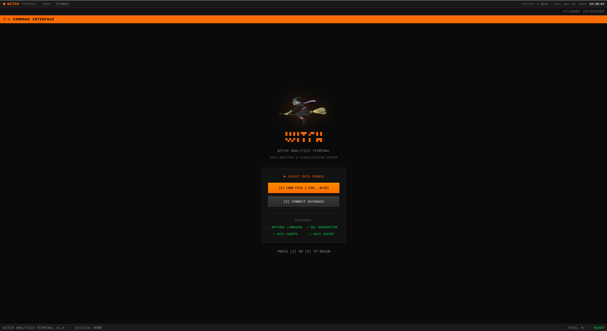

# [Witch](https://github.com/yourusername/witch) - AI Data Analyst

[](https://python.org)
[](https://fastapi.tiangolo.com)
[](https://react.dev)
[](https://postgresql.org)
[](https://openai.com)
[](LICENSE)
[]()

[](https://github.com/psf/black)
[](https://vitejs.dev)
[](https://tailwindcss.com)

**Talk to your database in plain English — get SQL, insights, and ML-ready datasets** 🧙‍♀️

*This is proprietary software. Viewing for educational purposes only. See [LICENSE](LICENSE).*

</div>

---

## 🖥️ Screenshots

<div align="center">

### Terminal Interface
| Landing Page | Database Connection |
|:------------:|:-------------------:|
|  | 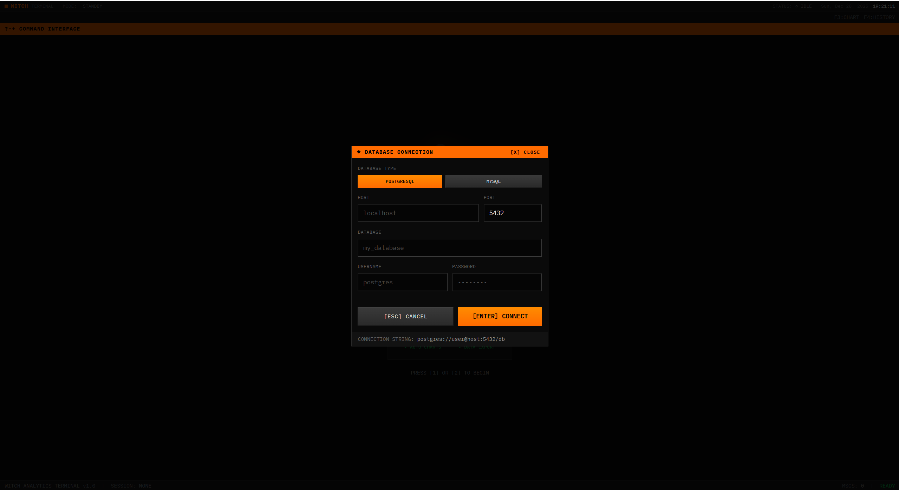 |

### AI Chat — Ask Questions, Get SQL
| Natural Language Query | SQL Generation | Results |
|:----------------------:|:--------------:|:-------:|
| 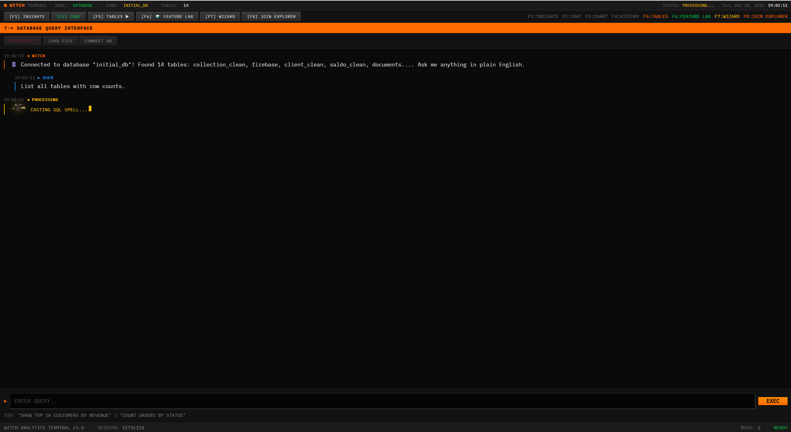 | 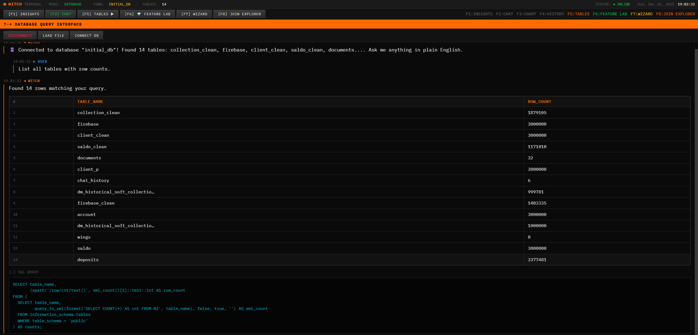 | 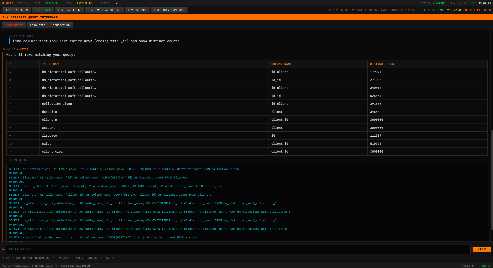 |

### ML Feature Engineering Dashboard
| Define Grain | Define Target | Build Features | Export |
|:------------:|:-------------:|:--------------:|:------:|
| 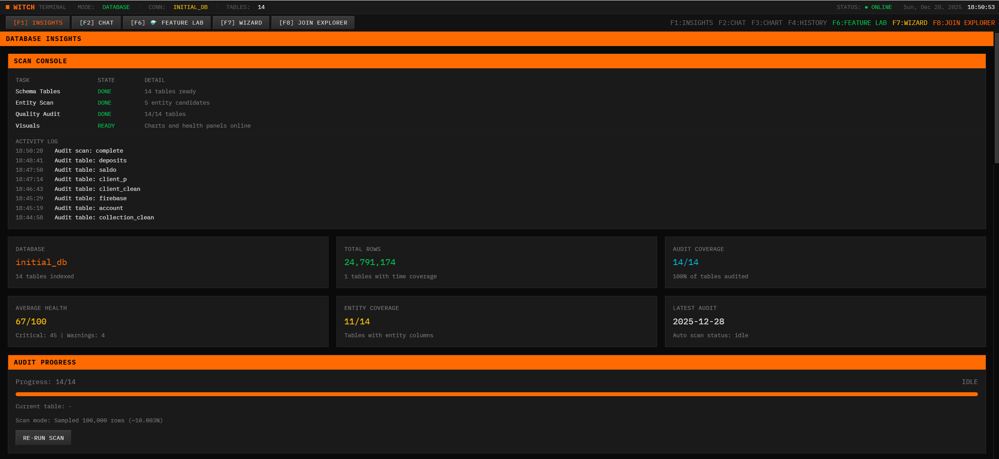 | 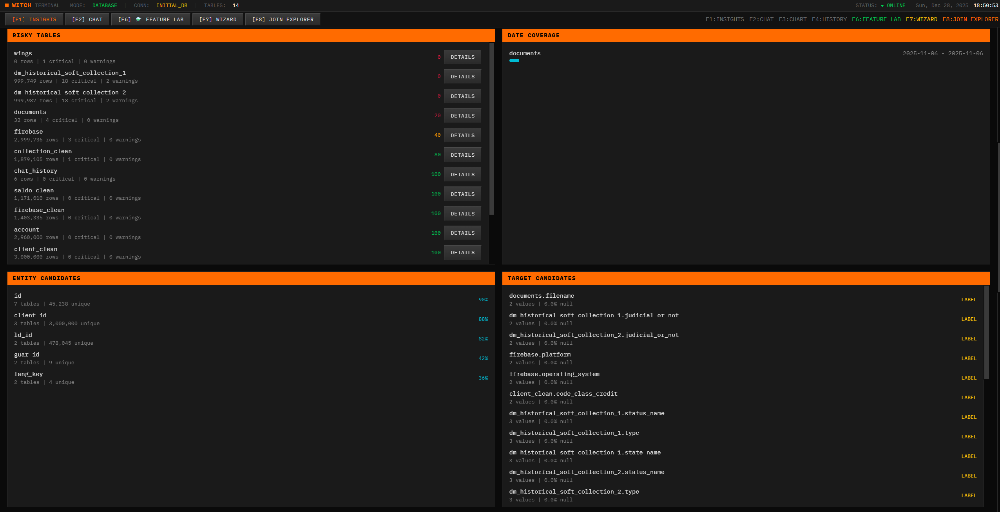 |  | 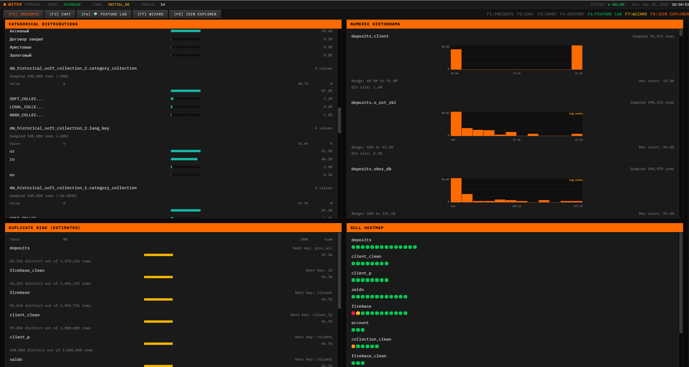 |

### Data Quality Audit
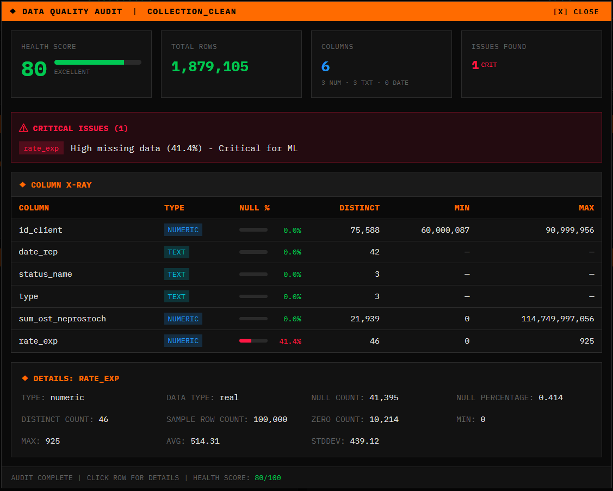

</div>

---

## ✨ Features

<table>
<tr>
<td width="50%">

### 🔮 Natural Language to SQL
Ask questions in plain English, get production-ready SQL

### 📊 ML Feature Engineering  
Build observation-aware features with leakage prevention

### 🎯 Click-to-Select Target
Define target variables without writing code

</td>
<td width="50%">

### ⚡ Real-time Validation
SQL syntax checking and data quality analysis

### 🔒 No Data Leakage
Automatic temporal isolation for ML features

### 📦 Export Ready
Complete SQL packages with metadata

</td>
</tr>
</table>

---

## 🏗️ Architecture

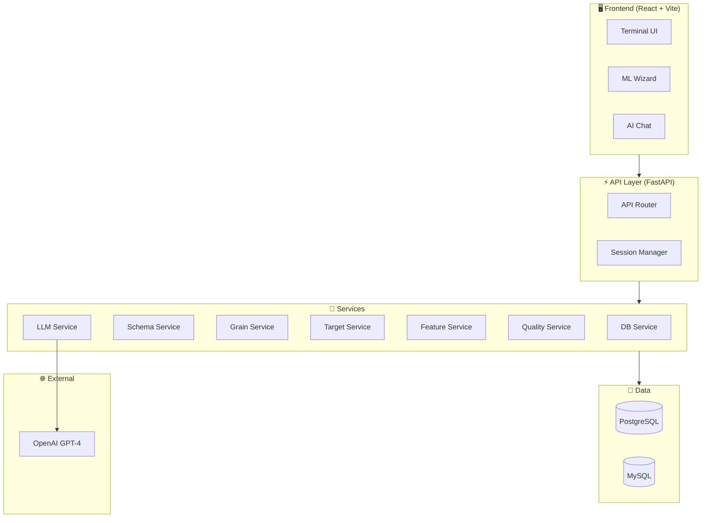

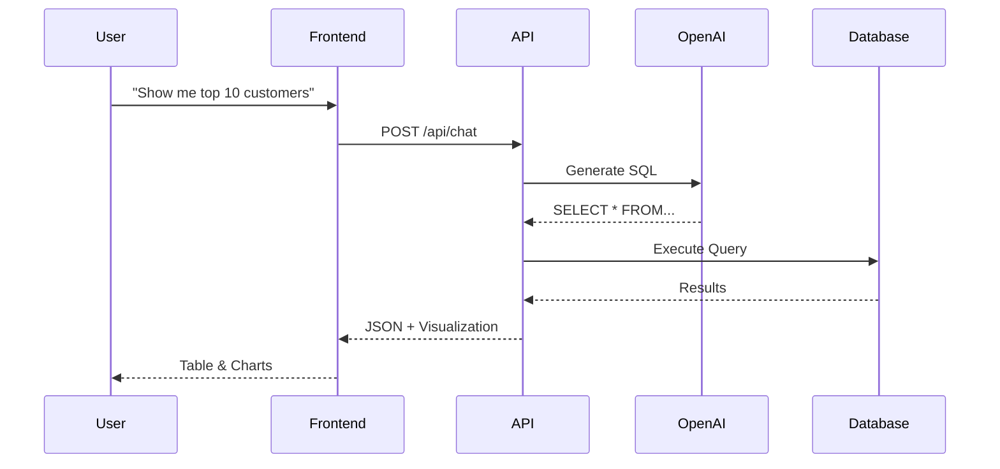

---

## 📈 Who Is This For?

| Role | Use Case |
|------|----------|
| **👨‍💼 Business Analysts** | Ask questions in plain English — no SQL needed |
| **👩‍🔬 Data Scientists** | Build ML datasets with proper train/test splits |
| **👨‍💻 Data Engineers** | Validate data quality, generate reproducible SQL |
| **🏢 Teams** | Connect to any SQL database, collaborate securely |

---

## 🛠️ Tech Stack

| Layer | Technology |
|-------|------------|
| **Frontend** | React 18, Vite, TailwindCSS |
| **Backend** | Python 3.11, FastAPI, SQLAlchemy |
| **Database** | PostgreSQL, MySQL |
| **AI** | OpenAI GPT-4, LangChain |
| **UI Theme** | Bloomberg Terminal-inspired |

---

## 📁 Structure

```
witch/
├── witch_backend/          # Python FastAPI
│   ├── app/api/           # 50+ REST endpoints
│   ├── app/services/      # Business logic
│   └── requirements.txt
│
├── witch_frontend/         # React + Vite
│   ├── src/components/    # UI Components
│   └── package.json
│
└── docs/images/           # Screenshots
```

---

## 📄 License

**⚠️ Proprietary Software — All Rights Reserved**

This repository is for viewing purposes only. Commercial use, copying, modification, or distribution requires explicit written permission and a paid license.

For licensing inquiries: [your-email@example.com]

---

<div align="center">

**Built for data scientists who hate data leakage** 🧙‍♀️

</div>
